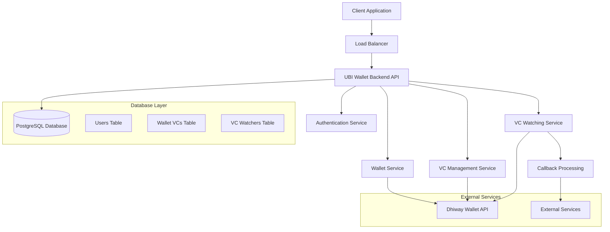
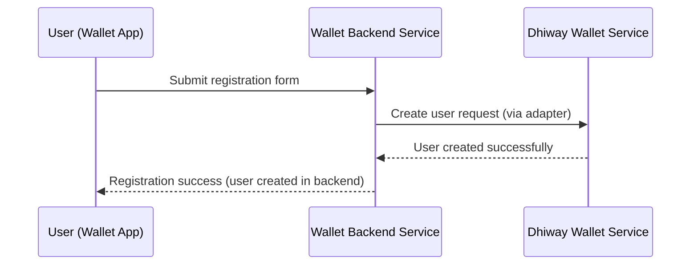
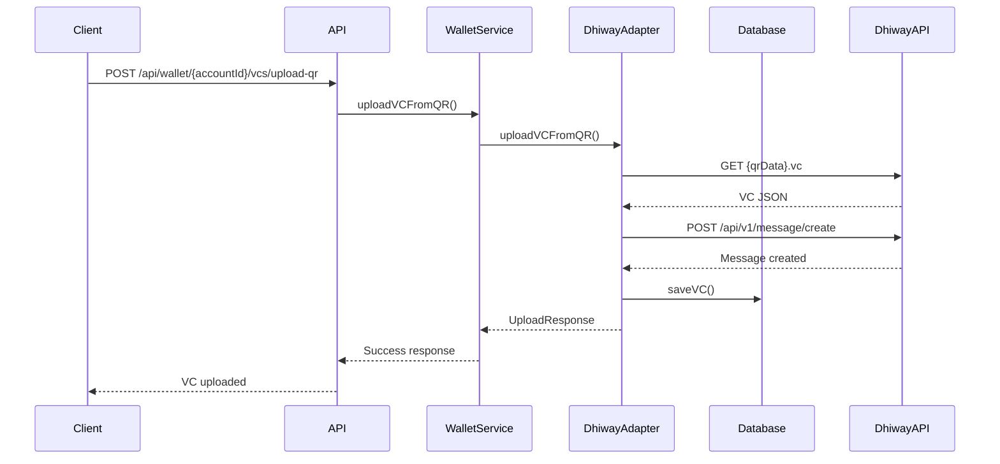
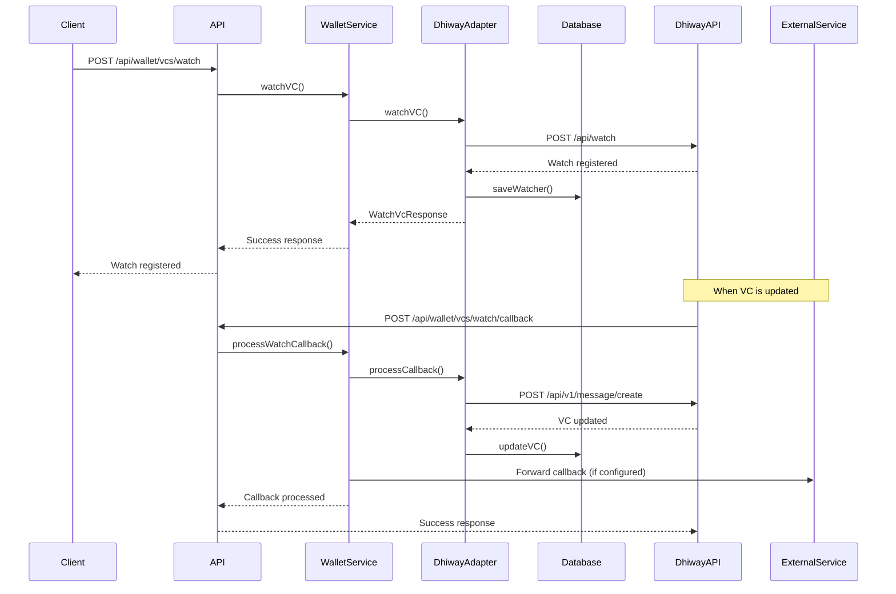
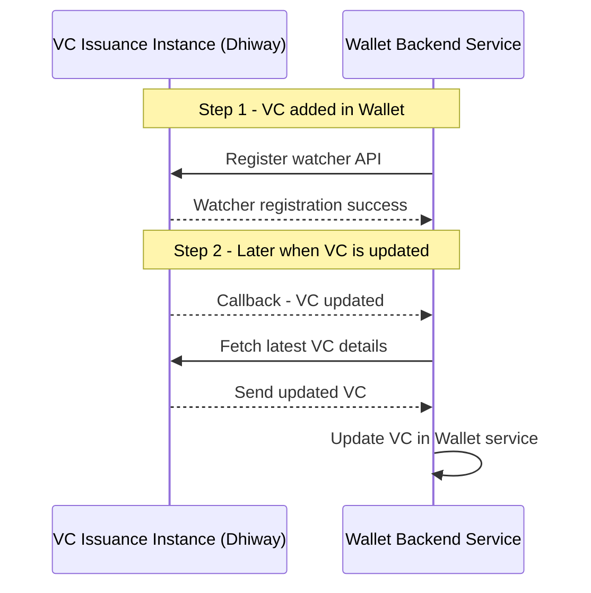
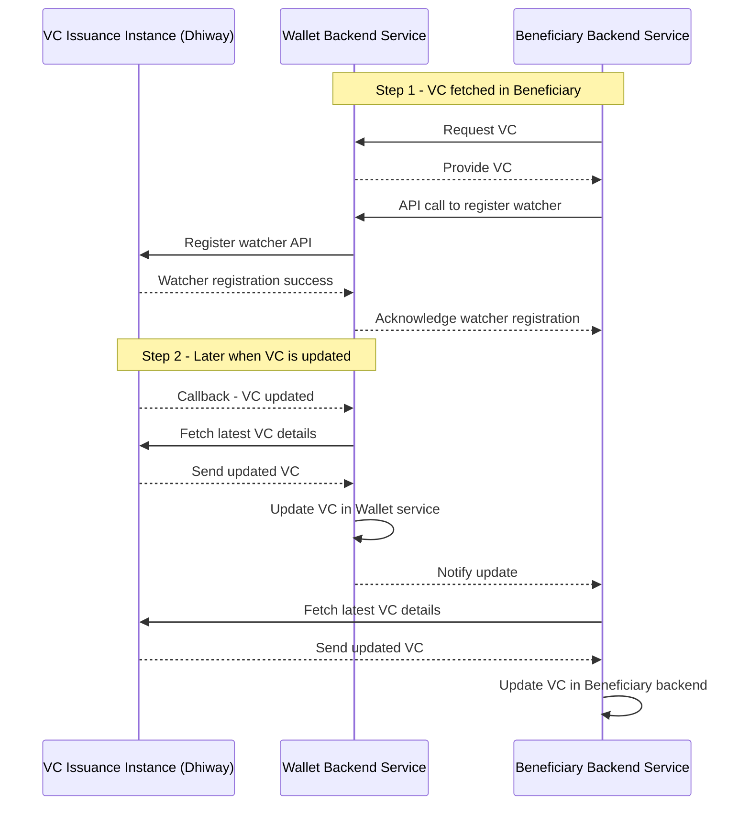

# UBI Wallet Service Architecture

## Overview

The UBI Wallet Service is a comprehensive digital wallet solution built with NestJS that serves as a middleware between consumer applications and wallet service providers. The system provides a standardized API for managing Verifiable Credentials (VCs) and user authentication across multiple wallet providers through a pluggable adapter pattern.

## High-Level Architecture



## Core Components

### 1. User Management Module (`src/users/`)

**Responsibilities:**
- User registration and onboarding
- Authentication and authorization
- User profile management
- Password hashing and validation

**Key Files:**
- `user.entity.ts`: Database entity definition
- `user.service.ts`: Business logic for user operations
- `user.module.ts`: Module configuration

### 2. Wallet Module (`src/wallet/`)

**Responsibilities:**
- Wallet operations coordination
- VC management and operations
- VC watching and callback processing
- API endpoint definitions

**Key Files:**
- `wallet.controller.ts`: REST API endpoints
- `wallet.service.ts`: Core business logic
- `wallet-vc.entity.ts`: VC database entity
- `wallet-vc-watcher.entity.ts`: VC watcher entity
- `watcher-cron.service.ts`: Scheduled tasks for VC monitoring

### 3. Adapter Layer (`src/adapters/`)

**Responsibilities:**
- External wallet provider integration
- API communication abstraction
- Response transformation
- Error handling for external services

**Key Files:**
- `adapter.factory.ts`: Adapter creation factory
- `dhiway.adapter.ts`: Dhiway-specific implementation
- `interfaces/wallet-adapter.interface.ts`: Adapter contracts

### 4. Common Module (`src/common/`)

**Responsibilities:**
- Shared utilities and services
- Logging infrastructure
- Authentication guards
- Common decorators

**Key Files:**
- `logger/logger.service.ts`: Centralized logging
- `guards/auth.guard.ts`: Authentication guard
- `decorators/user.decorator.ts`: User extraction decorator

### 5. Housekeeping Module (`src/housekeeping/`)

**Responsibilities:**
- Automated maintenance tasks
- VC synchronization
- Missing VC detection and registration
- System health monitoring

## Data Flow Diagrams

### User Registration Flow



### VC Upload Flow



### VC Watching Flow



### Watcher Flow 1 – Watcher registered when VC is added in Wallet

This flow describes the scenario where a watcher is automatically registered when a VC is added to the wallet service.



**Flow 1 Description:**
- **Trigger**: When a VC is uploaded/added to the wallet service
- **Process**: The wallet service automatically registers a watcher with the Dhiway issuance instance
- **Monitoring**: The watcher monitors for any updates to the VC
- **Update Handling**: When the VC is updated, the issuance instance sends a callback to the wallet service
- **Synchronization**: The wallet service fetches the latest VC details and updates its local database

### Watcher Flow 2 – Watcher registered when VC is fetched in Beneficiary

This flow describes the scenario where a watcher is registered when a VC is fetched by a beneficiary service.



**Flow 2 Description:**
- **Trigger**: When a beneficiary service requests a VC from the wallet service
- **Process**: The beneficiary service explicitly requests the wallet service to register a watcher
- **Registration**: The wallet service registers the watcher with the Dhiway issuance instance
- **Monitoring**: The watcher monitors for any updates to the VC
- **Update Handling**: When the VC is updated, the issuance instance sends a callback to the wallet service
- **Synchronization**: Both the wallet service and beneficiary service are notified and updated with the latest VC details

## Adding New Wallet Providers

The system is designed to be provider-agnostic through the adapter pattern. To add a new wallet provider, follow these steps:

### 1. Create a New Adapter

Create a new adapter file in `src/adapters/` (e.g., `newprovider.adapter.ts`):

```typescript
import { Injectable } from '@nestjs/common';
import { IWalletAdapter, IWalletAdapterWithOtp } from './interfaces/wallet-adapter.interface';
import { OnboardUserDto } from '../dto/onboard-user.dto';
import { UploadVcDto } from '../dto/upload-vc.dto';
import { WatchVcDto } from '../dto/watch-vc.dto';
import { WatchCallbackDto } from '../dto/watch-callback.dto';

@Injectable()
export class NewProviderAdapter implements IWalletAdapter {
  private readonly apiBaseUrl: string;
  private readonly apiKey: string;

  constructor() {
    this.apiBaseUrl = process.env.NEW_PROVIDER_API_BASE || '';
    this.apiKey = process.env.NEW_PROVIDER_API_KEY || '';
  }

  async onboardUser(data: OnboardUserDto) {
    // Implement user onboarding logic
    // Make API calls to the new provider
    // Transform responses to match the interface
  }

  async getAllVCs(userId: string, token: string) {
    // Implement VC listing logic
  }

  async getVCById(userId: string, vcId: string, token: string) {
    // Implement VC retrieval logic
  }

  async uploadVCFromQR(userId: string, qrData: string, token: string) {
    // Implement VC upload logic
  }

  async login(data: any) {
    // Implement login logic
  }

  // Optional: Implement OTP methods if supported
  async verifyLogin?(data: any) {
    // Implement OTP verification
  }

  async resendOtp?(data: any) {
    // Implement OTP resend
  }

  // Optional: Implement watching methods if supported
  async watchVC?(data: WatchVcDto) {
    // Implement VC watching
  }

  async processCallback?(data: WatchCallbackDto) {
    // Implement callback processing
  }
}
```

### 2. Update the Adapter Factory

Modify `src/adapters/adapter.factory.ts`:

```typescript
import { DhiwayAdapter } from './dhiway.adapter';
import { NewProviderAdapter } from './newprovider.adapter';

export function createWalletAdapter(): IWalletAdapter {
  const provider = process.env.WALLET_PROVIDER || 'dhiway';
  
  switch (provider) {
    case 'dhiway':
      return new DhiwayAdapter();
    case 'newprovider':
      return new NewProviderAdapter();
    default:
      throw new Error(`Unsupported wallet provider: ${provider}`);
  }
}
```

### 3. Update Environment Variables

Add new provider configuration to `.env.example`:

```bash
# New Provider Configuration
NEW_PROVIDER_API_BASE=https://api.newprovider.com
NEW_PROVIDER_API_KEY=your-new-provider-api-key
```

### 4. Update the Wallet Module

Modify `src/wallet/wallet.module.ts`:

```typescript
import { NewProviderAdapter } from '../adapters/newprovider.adapter';

@Module({
  // ... existing imports
  providers: [
    WalletService,
    WalletVCService,
    WalletVCWatcherService,
    WatcherCronService,
    {
      provide: 'WALLET_ADAPTER',
      useFactory: createWalletAdapter,
    },
    DhiwayAdapter,
    NewProviderAdapter, // Add new adapter
  ],
  // ... rest of module
})
export class WalletModule {}
```

### 5. Update Configuration

Set the new provider in your environment:

```bash
WALLET_PROVIDER=newprovider
```

## Design Patterns Used

1. **Adapter Pattern**: Used for wallet provider integration
2. **Repository Pattern**: Used for data access layer
3. **Service Layer Pattern**: Used for business logic
4. **Observer Pattern**: Used for VC watching and callbacks
5. **Factory Pattern**: Used for adapter creation

## Key Design Principles

- **Separation of Concerns**: Clear separation between controllers, services, and data access
- **Dependency Injection**: Heavy use of NestJS DI container
- **Interface Segregation**: Small, focused interfaces for different concerns
- **Open/Closed Principle**: Extensible through adapter pattern
- **Single Responsibility**: Each module has a single, well-defined purpose

## Security Considerations

- All API endpoints require authentication
- Sensitive data is encrypted and hashed
- CORS is properly configured
- Input validation is enforced at all levels
- Audit trails are maintained for all operations

## Scalability Features

- Stateless design for horizontal scaling
- Database connection pooling
- Caching mechanisms for frequently accessed data
- Asynchronous processing for heavy operations
- Health checks and monitoring endpoints

## Monitoring and Logging

- Comprehensive logging at all levels
- Health check endpoints
- Performance metrics
- Error tracking and alerting
- Audit trails for compliance

This architecture provides a robust, scalable, and maintainable solution for digital wallet operations while maintaining flexibility for future enhancements and new provider integrations.